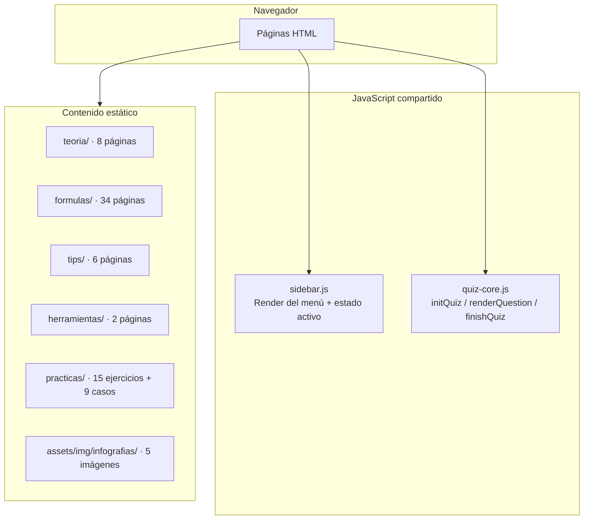
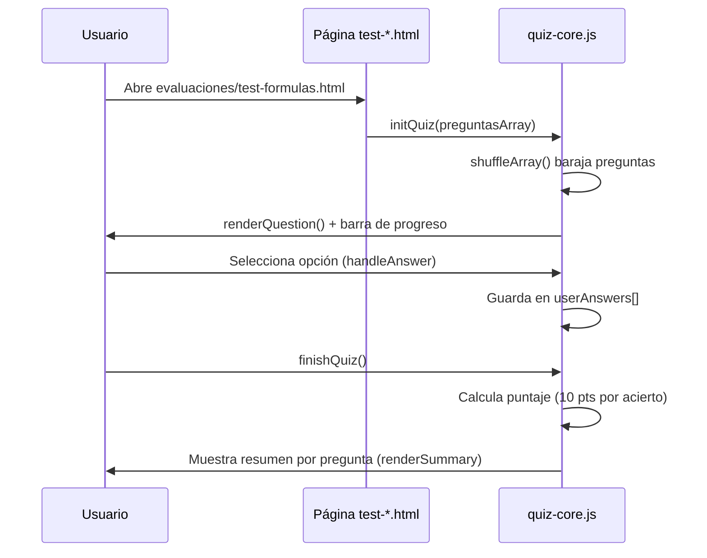
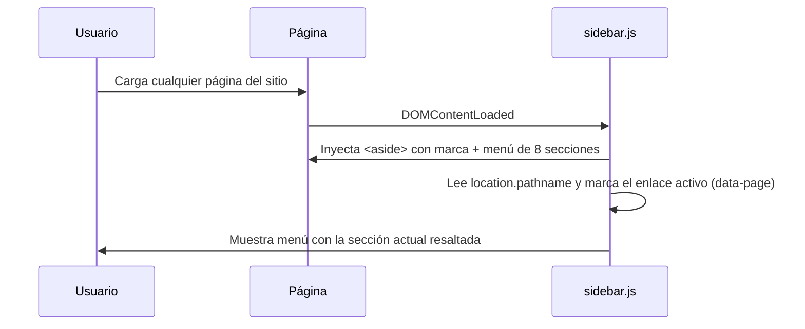
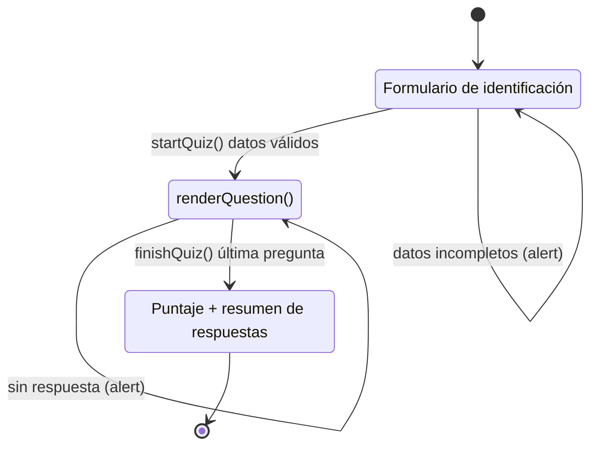

# Arquitectura Global — Excel Learning Hub

Este documento describe la arquitectura técnica del portal educativo. Complementa a [CONTEXTO_PROYECTO.md](CONTEXTO_PROYECTO.md) y [PERSISTENCIA.md](PERSISTENCIA.md).

## 1. Diagrama de capas

```
┌────────────────────────────────────────────────────────────┐
│  PRESENTACIÓN                                               │
│  Páginas HTML estáticas + estilos + JavaScript vanilla     │
│  (teoria/, formulas/, tips/, herramientas/, evaluaciones/) │
└──────────────────────────────┬─────────────────────────────┘
                               │ DOM (preguntas embebidas en HTML)
┌──────────────────────────────▼─────────────────────────────┐
│  COMPONENTES / MÓDULOS JS                                   │
│  sidebar.js   → navegación lateral única                    │
│  quiz-core.js → motor de tests (estático, preguntas locales)│
└──────────────────────────────┬─────────────────────────────┘
                               │
┌──────────────────────────────▼─────────────────────────────┐
│  INFRAESTRUCTURA                                            │
│  Vercel (hosting estático, vercel.json con cleanUrls)       │
└─────────────────────────────────────────────────────────────┘
```

## 2. Diagrama C4 de componentes



## 3. Flujos críticos

### 3.1 Flujo de una evaluación (quiz-core.js)



> **Nota:** Las preguntas están embebidas directamente en el HTML de cada test. No hay llamadas a servicios externos.

### 3.2 Arranque y navegación (sidebar.js)



### 3.3 Vista de infografía con modal (index.html)

1. El usuario hace clic en una `.infografia-card`.
2. `openModal(src, alt)` muestra `#infoModal`, fija la imagen en `#modalImg` y ajusta el enlace de descarga.
3. El arrastre con el ratón sobre `#modalBody` desplaza verticalmente la imagen (umbral de 5 px para distinguir arrastre de clic).
4. `closeModal()` oculta el modal; el clic en el fondo solo cierra si no hubo arrastre (`wasDragging`).

## 4. Máquina de estados de una evaluación



## 5. Registro de ADRs

Los ADRs se numeran de forma continua. El siguiente ADR será **ADR-013**.

### ADR-001 — Sitio estático vanilla (HTML/CSS/JS) sin framework

- **Contexto:** El proyecto debía publicarse rápido como material de un curso y mantenerse sencillo para un solo autor docente.
- **Decisión Adoptada:**
  1. No usar framework de frontend ni gestor de paquetes.
  2. Cada módulo es una página HTML independiente.
  3. JavaScript modular solo donde hay interacción (sidebar, modal, buscadores, quizzes).
- **Consecuencias Positivas:**
  - Despliegue trivial en cualquier hosting estático.
  - Cero build time y cero dependencias de runtime para el contenido.
  - Facilita la edición del contenido por parte del profesor.

### ADR-002 — Despliegue en Vercel con `cleanUrls`

- **Contexto:** Se requería un hosting con HTTPS, CDN y URLs limpias sin extensión `.html`.
- **Decisión Adoptada:**
  1. Configurar `vercel.json` con `"cleanUrls": true` y `"trailingSlash": false`.
- **Consecuencias Positivas:**
  - URLs legibles y compartibles (p. ej. `/formulas/suma`).
  - Despliegue automático desde Git.

### ADR-003 — Supabase como backend de evaluaciones (OBSOLETO)

> **Estado:** reemplazado por [ADR-012](#adr-012--eliminación-de-supabase-y-evaluaciones-100-estáticas).

- **Contexto:** El sitio es estático pero las evaluaciones necesitan leer preguntas y guardar resultados de estudiantes.
- **Decisión Adoptada:**
  1. Usar Supabase (PostgreSQL + cliente JS desde CDN) con la *publishable key*.
  2. Esquema relacional: `tests`, `preguntas` (con `opciones` JSONB) y `resultados`.
- **Consecuencias Positivas:**
  - Backend serverless sin servidor propio.
  - Lectura de preguntas desde BD sin recompilar HTML.
  - Registro persistente de notas de estudiantes.

### ADR-004 — Evaluaciones de 10 preguntas con puntaje escalado

- **Contexto:** Se quería una certificación uniforme y simple de calcular.
- **Decisión Adoptada:**
  1. Cada test tiene 10 preguntas embebidas en el HTML.
  2. En `quiz-core.js` cada acierto suma 10 puntos (escala 0–100).
  3. Las preguntas se barajan aleatoriamente (`shuffleArray`) y las respuestas están dispersas.
- **Consecuencias Positivas:**
  - Cálculo transparente y feedback inmediato al estudiante.
  - Cada estudiante ve un orden distinto de preguntas.

### ADR-005 — Navegación lateral única con `sidebar.js`

- **Contexto:** Más de 60 páginas repetían la estructura de menú; cambiarla a mano era frágil.
- **Decisión Adoptada:**
  1. Un único `sidebar.js` inyecta el `<aside>` con la marca y las 8 secciones.
  2. El resaltado de la sección activa se deriva de `window.location.pathname` con el atributo `data-page`.
- **Consecuencias Positivas:**
  - Cambiar la navegación una sola vez afecta a todo el sitio.
  - Consistencia visual garantizada entre páginas.

### ADR-006 — Sistema de diseño con variables CSS y acento verde Excel

- **Contexto:** Se requería una identidad visual acorde a Excel y fácil de ajustar.
- **Decisión Adoptada:**
  1. Tokens de diseño en `:root` de `assets/css/main-style.css` (`--accent: #107c41`, paleta Slate).
  2. Fuente Inter vía Google Fonts.
  3. Responsive mediante media queries (768px y 480px) con sidebar que pasa a barra superior.
- **Consecuencias Positivas:**
  - Temas consistentes y cambio de color en un solo lugar.
  - Buen rendimiento visual en móvil.

### ADR-007 — Contenido educativo como páginas HTML estáticas por tema

- **Contexto:** El material (teoría, fórmulas, tips) es estable y de solo lectura.
- **Decisión Adoptada:**
  1. Una página por tema (p. ej. `formulas/buscarv.html`, `teoria/anatomia-funcion.html`).
  2. Plantilla compartida `.guide-content` con bloques de sintaxis, argumentos y ejemplos.
- **Consecuencias Positivas:**
  - Contenido indexable por buscadores y descargable.
  - No requiere base de datos para el contenido principal.

### ADR-008 — Integración de IA en Excel vía función VBA (revertida)

> **Estado:** reemplazado por [ADR-009](#adr-009--eliminacion-de-la-integracion-de-ia-en-vba).

- **Contexto:** Los estudiantes avanzados pedían un puente entre Excel y la IA generativa.
- **Decisión Adoptada:**
  1. Función VBA `GEMINI_PROMPT2(rangoDatos, promptUsuario)` en `practicas/gemini_prompt.bas`.
  2. Convierte el rango a CSV, lo adjunta al prompt y llama al modelo `gemini-3.1-flash-lite` por HTTP (WinHttp).
  3. Parsea la respuesta JSON con extracción basada en tokens y restauración de comillas.
- **Consecuencias Positivas:**
  - Analiza datos reales de la hoja sin salir de Excel.
  - Enseña el patrón de integración de APIs en VBA.

### ADR-009 — Eliminación de la integración de IA en VBA

- **Contexto:** `practicas/gemini_prompt.bas` contenía una API key de Google válida versionada en un repositorio público (riesgo de abuso) y el recurso dejó de ser necesario para el curso.
- **Decisión Adoptada:**
  1. Eliminar `practicas/gemini_prompt.bas` del repositorio.
  2. Retirar la sección "Macros y Programación (VBA)" de `practicas.html`.
  3. No versionar claves API reales; en el futuro usar placeholders y variables de entorno.
- **Consecuencias Positivas:**
  - Se elimina el riesgo de uso indebido de la clave expuesta.
  - El repositorio queda libre de secretos.
- **Consecuencias Negativas:**
  - Se pierde la funcionalidad de analizar datos con IA directamente en Excel (no requerida por el curso).

### ADR-010 — Estilos de guía unificados, SEO básico y PWA

- **Contexto:** Cada guía repetía el mismo bloque `<style>` (reglas `.guide-content`, `.syntax`, etc.) y el sitio carecía de elementos mínimos de indexación y de instalabilidad móvil.
- **Decisión Adoptada:**
  1. Crear `assets/css/guide-style.css` con los estilos compartidos de guías y eliminar los `<style>` duplicados de `formulas/`, `teoria/`, `tips/` y `herramientas/` (las páginas lo enlazan vía `../assets/css/guide-style.css`).
  2. Añadir `robots.txt`, `sitemap.xml`, `favicon.svg`, `404.html` y meta descriptions generadas desde el primer párrafo de cada guía.
  3. PWA básica: `manifest.webmanifest` + `sw.js` (cache-first de estáticos) registrado en las 8 páginas raíz.
- **Consecuencias Positivas:**
  - Un solo punto de edición para el estilo de guías.
  - El sitio es indexable (sitemap + robots + descriptions) e instalable en móvil (PWA).
- **Consecuencias Negativas:**
  - El cache-first de `sw.js` puede servir contenido envejecido hasta actualizar la versión de caché.

### ADR-011 — Retiro del PWA (service worker)

- **Contexto:** El `sw.js` v1 precacheaba URLs `.html` que Vercel responde con una redirección 308 (cleanUrls), lo que rompía la caché y producía `ERR_FAILED` al navegar en los navegadores que ya lo tenían instalado. Una v2 (network-first) resolvió el fallo, pero por simplicidad y claridad de un proyecto educativo se decidió retirar el PWA por completo.
- **Decisión Adoptada:** Eliminar `manifest.webmanifest`, `sw.js` y su registro de las 8 páginas raíz. El sitio consulta siempre al servidor, sin caché de service worker.
- **Consecuencias Positivas:**
  - Desaparece la clase de problemas de caché obsoleta y de estados corruptos por navegador.
  - Un concepto menos que mantener y explicar.
- **Consecuencias Negativas:**
  - Se pierde la instalabilidad en móvil y el funcionamiento offline.
  - Los navegadores que ya tenían el SW lo eliminarán solos al detectar el 404 de `/sw.js`.

### ADR-012 — Eliminación de Supabase y evaluaciones 100% estáticas

- **Contexto:** Las evaluaciones usaban Supabase para leer preguntas y guardar resultados, lo que añadía una dependencia externa innecesaria para un proyecto educativo. Las preguntas son estables y no cambian frecuentemente.
- **Decisión Adoptada:**
  1. Eliminar la dependencia de Supabase de `quiz-core.js`.
  2. Embeber las preguntas directamente en el HTML de cada test como arrays de JavaScript.
  3. Eliminar `evaluaciones.js` (motor dinámico sin uso).
  4. Eliminar los tests legacy (`test-atajos.html`, `test-teoria2.html`).
  5. Agregar `shuffleArray()` para barajar preguntas aleatoriamente.
  6. Mostrar nombre del estudiante en la pantalla de resultados.
- **Consecuencias Positivas:**
  - Cero dependencias externas para las evaluaciones.
  - El sitio funciona 100% sin conexión a internet (excepto el hosting).
  - Mantenimiento simplificado: editar preguntas directamente en el HTML.
  - Sin costos de Supabase.
- **Consecuencias Negativas:**
  - No se persisten resultados de evaluaciones (solo en memoria del navegador).
  - Las preguntas no se pueden actualizar sin editar el código fuente.

## 6. Notas de mantenimiento

- **Contenido:** agregar una fórmula nueva implica crear el archivo en `formulas/` y añadir su tarjeta en `formulas.html`.
- **Evaluaciones:** para un test nuevo, duplicar un `test-*.html`, cambiar el título y las preguntas del array `preguntasArray`. Luego añadir el enlace en `evaluaciones.html`.
- **Seguridad:** no hay claves API en el repositorio. Todo el código es estático y no maneja datos sensibles del servidor.
