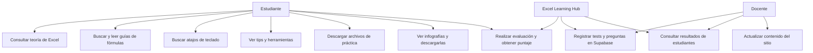
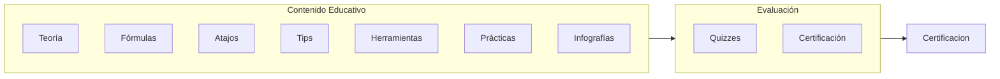

# Contexto del Proyecto — Excel Learning Hub

## 1. Propósito de negocio y alcance

Portal educativo de consulta y recursos de Excel para estudiantes del **Instituto Nueva Tecnología** (curso del Prof. Samuel Durán). El sitio centraliza teoría, fórmulas, atajos, tips, herramientas, prácticas descargables, infografías y evaluaciones con certificación.

### Dentro del Alcance
- Contenido teórico y práctico de Excel (2016 y 2019/365).
- Biblioteca de fórmulas con sintaxis, argumentos y ejemplos.
- Catálogo de atajos de teclado con búsqueda.
- Archivos de práctica descargables (XLSX, DOCX, PDF) y casos empresariales.
- Evaluaciones de 10 preguntas con registro de resultados.

### Fuera del Alcance
- Backend de autenticación de usuarios (las evaluaciones registran nombre/curso como texto).
- CMS: el contenido se edita directamente sobre los archivos HTML.
- Soporte offline de las evaluaciones (requieren Supabase).
- Compatibilidad con versiones de Excel anteriores a 2016.

## 2. Diagrama de casos de uso



## 3. Mapa de módulos / dominio



## 4. Árbol de directorios real

```
vanilla-blog-excel/
├── index.html                     # Galería de infografías + modal con descarga
├── atajos.html                    # Catálogo de atajos con buscador en vivo
├── formulas.html                  # Biblioteca de fórmulas por nivel y categoría
├── herramientas.html              # Índice de herramientas de Excel
├── practicas.html                 # Lista de archivos de práctica descargables
├── teoria.html                    # Índice de temas teóricos
├── tips.html                      # Índice de tips y trucos
├── evaluaciones.html              # Centro de certificaciones (enlaces a tests)
├── 404.html                       # Página de error 404 (no indexada)
├── robots.txt                     # Permite el rastreo completo y apunta al sitemap
├── sitemap.xml                    # Mapa del sitio (61 URLs en https://excel.samydex.cv)
├── manifest.webmanifest           # Manifiesto PWA (nombre, icono, tema)
├── sw.js                          # Service worker PWA (cache-first de estáticos)
├── vercel.json                    # Config de despliegue (cleanUrls)
├── assets/
│   ├── css/
│   │   ├── main-style.css         # Sistema de diseño (variables, responsive)
│   │   └── guide-style.css        # Estilos compartidos de guías (formulas/teoria/tips/herramientas)
│   ├── favicon.svg                # Icono del sitio (cuadro verde con "X")
│   ├── js/
│   │   ├── sidebar.js             # Navegación lateral única e inyección del menú
│   │   ├── quiz-core.js           # Motor de tests con TEST_ID fijo + Supabase
│   │   └── evaluaciones.js        # Motor de tests dinámico (lista desde BD)
│   ├── img/                       # Banners, diagramas y capturas de apoyo
│   │   └── infografias/           # 5 infografías de la galería
│   └── db/
│       ├── eschema.sql            # Esquema: tests, preguntas, resultados
│       └── insert_preguntas_teoria.sql  # Semillas de preguntas (tests 1 y 2)
├── teoria/                        # 8 páginas de teoría (entorno, tipos de datos, ...)
├── formulas/                      # 34 guías de funciones (suma.html, buscarv.html, ...)
├── tips/                          # 6 tips (relleno-rapido, transponer, ...)
├── herramientas/                  # 2 guías (texto-en-columnas, validacion-datos)
├── evaluaciones/                  # 3 tests (test-atajos, test-teoria, test-teoria2)
└── practicas/
    └── archivos_practica/         # 15+ archivos XLSX, DOCX, PDF de ejercicios
```

## 5. Stack tecnológico

| Categoría | Tecnología | Versión | Justificación |
|-----------|------------|---------|---------------|
| Lenguaje | HTML5 + CSS3 + JavaScript (vanilla) | — | Cero dependencias, fácil edición por el docente |
| Hosting | Vercel | — | CDN global, HTTPS y `cleanUrls` |
| Backend de datos | Supabase (PostgreSQL + JS client) | supabase-js v2 (CDN) | Lectura de preguntas y guardado de resultados sin servidor |
| Fuentes | Google Fonts (Inter) | — | Tipografía limpia y legible |

No hay gestor de paquetes ni build system: el sitio se publica tal cual.

## 6. Glosario de dominio breve

| Término | Definición |
|---------|------------|
| Infografía | Imagen educativa de la galería, visualizable a pantalla completa y descargable. |
| Test / Certificación | Evaluación de 10 preguntas con registro del estudiante y puntaje. |
| Caso práctico | Ejercicio basado en empresas ficticias (PixelWorld, BeatWave) para aplicar Excel. |
| Práctica | Archivo descargable (XLSX/DOCX/PDF) para ejercitar habilidades. |
| Fórmula moderna | Funciones de Excel 2019/365 como BUSCARX, FILTRAR, LET, DIVIDIRTEXTO. |

Consulta el [GLOSARIO_TECNICO.md](GLOSARIO_TECNICO.md) para el glosario completo y la [PROPUESTA_COMERCIAL.md](PROPUESTA_COMERCIAL.md) para el valor de negocio.
