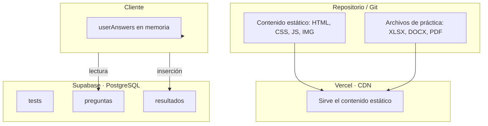
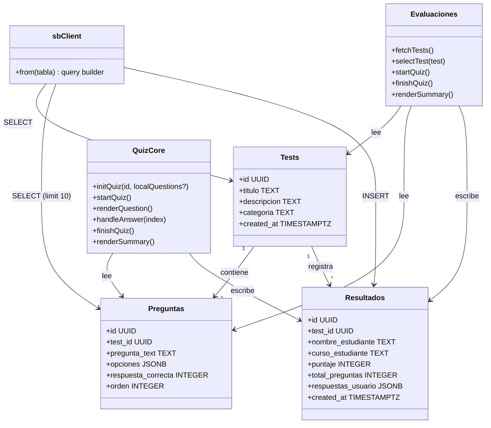
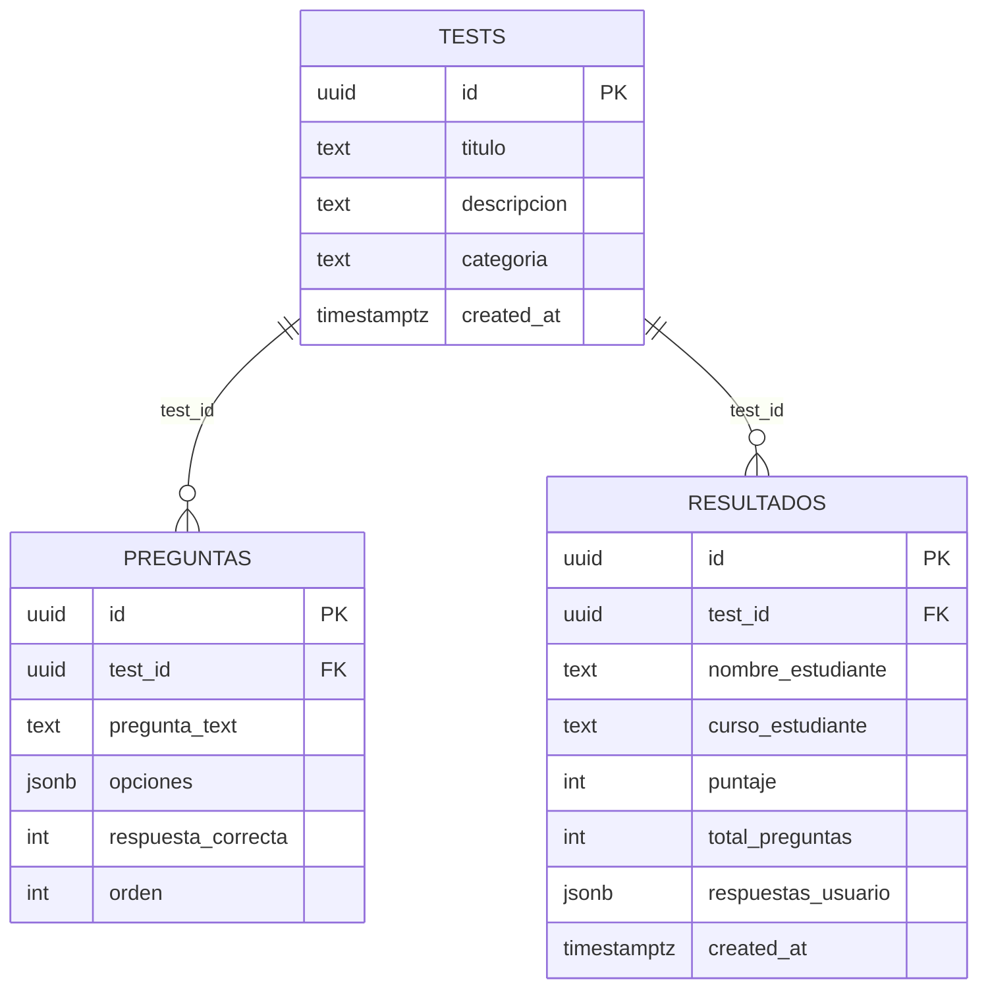

# Persistencia — Excel Learning Hub

Estrategia de almacenamiento del proyecto. La mayor parte del sitio es contenido estático (HTML/CSS/JS/imágenes/archivos). La única persistencia dinámica son los datos de las evaluaciones, gestionados por **Supabase** (PostgreSQL). Este documento describe ambas capas.

## 1. Estrategia de persistencia

- **Contenido estático:** persistido en Git y servido por Vercel. No hay base de datos para teoría, fórmulas, tips, atajos ni prácticas.
- **Evaluaciones:** datos en Supabase (PostgreSQL). Las respuestas del estudiante solo viven en memoria durante el test (`userAnswers[]`) y se descartan al salir; lo persistente es el resultado final en `resultados`.

## 2. Entidades almacenadas

### 2.1 Supabase (PostgreSQL) — esquema `assets/db/eschema.sql`

| Entidad | Clave | Tipo | Valor por defecto | Descripción |
|---------|-------|------|-------------------|-------------|
| `tests` | `id` | UUID (`gen_random_uuid()`) | — | Identificador de cada evaluación |
| `tests` | `titulo` | TEXT | — | Nombre del test |
| `tests` | `descripcion` | TEXT | NULL | Descripción visible al estudiante |
| `tests` | `categoria` | TEXT | NULL | Categoría (p. ej. "Excel Básico", "Excel Avanzado") |
| `tests` | `created_at` | TIMESTAMPTZ | `NOW()` | Fecha de creación |
| `preguntas` | `id` | UUID (`gen_random_uuid()`) | — | Identificador de la pregunta |
| `preguntas` | `test_id` | UUID → FK `tests(id)` | — | Test al que pertenece (ON DELETE CASCADE) |
| `preguntas` | `pregunta_text` | TEXT | — | Enunciado de la pregunta |
| `preguntas` | `opciones` | JSONB | — | Arreglo de opciones, p. ej. `["A", "B", "C", "D"]` |
| `preguntas` | `respuesta_correcta` | INTEGER | — | Índice (0, 1, 2, 3) de la opción correcta |
| `preguntas` | `orden` | INTEGER | 0 | Orden de presentación |
| `resultados` | `id` | UUID (`gen_random_uuid()`) | — | Identificador del resultado |
| `resultados` | `test_id` | UUID → FK `tests(id)` | — | Test realizado |
| `resultados` | `nombre_estudiante` | TEXT | — | Nombre del estudiante |
| `resultados` | `curso_estudiante` | TEXT | — | Curso del estudiante (p. ej. "Excel") |
| `resultados` | `puntaje` | INTEGER | — | Puntaje obtenido |
| `resultados` | `total_preguntas` | INTEGER | — | Total de preguntas del test |
| `resultados` | `respuestas_usuario` | JSONB | NULL | Arreglo con lo que marcó el estudiante |
| `resultados` | `created_at` | TIMESTAMPTZ | `NOW()` | Fecha del resultado |

### 2.2 Datos semilla

`assets/db/insert_preguntas_teoria.sql` inserta 10 preguntas para el test de Fundamentos Parte 1 (`659691e6-242a-453d-85b2-c9cfd6335fd3`) y 10 para la Parte 2 (`a0c03649-6474-4b3a-82e1-f630acf1bae9`). El test de Atajos usa `1074648d-b956-4b83-bdac-e10c1be09a80` (definido en `evaluaciones/test-atajos.html`).

### 2.3 Identificadores en el código

| Test | `TEST_ID` | Archivo |
|------|-----------|---------|
| Certificación en Atajos | `1074648d-b956-4b83-bdac-e10c1be09a80` | `evaluaciones/test-atajos.html` |
| Fundamentos Parte 1 | `659691e6-242a-453d-85b2-c9cfd6335fd3` | `evaluaciones/test-teoria.html` |
| Fundamentos Parte 2 | `a0c03649-6474-4b3a-82e1-f630acf1bae9` | `evaluaciones/test-teoria2.html` |

## 3. Diagrama de clases (módulo de evaluaciones)

## 4. Diagrama entidad-relación

## 5. Diccionario de datos

### Entidad `preguntas`

| Campo | Tipo | Restricciones | Descripción de Negocio |
|-------|------|---------------|------------------------|
| `id` | UUID | PK, autogenerado | Clave única de la pregunta |
| `test_id` | UUID | FK → `tests.id`, NOT NULL, ON DELETE CASCADE | Evaluación a la que pertenece |
| `pregunta_text` | TEXT | NOT NULL | Enunciado que ve el estudiante |
| `opciones` | JSONB | NOT NULL, arreglo | Alternativas A, B, C, D... |
| `respuesta_correcta` | INTEGER | NOT NULL, índice del arreglo | Cuál es la opción correcta |
| `orden` | INTEGER | DEFAULT 0 | Orden de aparición en el test |

### Entidad `resultados`

| Campo | Tipo | Restricciones | Descripción de Negocio |
|-------|------|---------------|------------------------|
| `id` | UUID | PK, autogenerado | Clave única del resultado |
| `test_id` | UUID | FK → `tests.id`, NOT NULL | Test que se presentó |
| `nombre_estudiante` | TEXT | NOT NULL | Quién rindió la evaluación |
| `curso_estudiante` | TEXT | NOT NULL | Curso/grupo del estudiante |
| `puntaje` | INTEGER | NOT NULL | Nota obtenida |
| `total_preguntas` | INTEGER | NOT NULL | Cantidad de preguntas |
| `respuestas_usuario` | JSONB | NULL | Trazabilidad de respuestas marcadas |
| `created_at` | TIMESTAMPTZ | DEFAULT `NOW()` | Fecha y hora del resultado |

## 6. Reglas de integridad y rendimiento

- **Integridad referencial:** `preguntas.test_id` y `resultados.test_id` referencian `tests.id`; borrar un test elimina sus preguntas (`ON DELETE CASCADE`).
- **Top de preguntas:** `quiz-core.js` solicita `.limit(10)`; si el test no tiene 10 preguntas, no arranca (validación con `alert`).
- **Puntaje:** en `quiz-core.js` cada acierto suma 10 (escala 0–100); en `evaluaciones.js` suma 1 por acierto y muestra el total. El `puntaje` persistido depende del motor usado.
- **Respuestas en memoria:** `userAnswers[]` no se persiste durante el test; solo el resultado final se inserta en `resultados`.
- **Seguridad:** el cliente usa la *publishable key* de Supabase (RLS debe limitar la escritura a `resultados` y la lectura de `tests`/`preguntas`). No se deben exponer claves de servicio en el repositorio.
- **Contenido estático:** no aplica caché especial; Vercel entrega por CDN. `vercel.json` activa `cleanUrls` para rutas sin extensión.

## Referencias cruzadas

- Esquema SQL real: `assets/db/eschema.sql` y semillas en `assets/db/insert_preguntas_teoria.sql`.
- Conexión y consultas: `assets/js/quiz-core.js`, `assets/js/evaluaciones.js`.
- Arquitectura general: [ARQUITECTURA_GLOBAL.md](ARQUITECTURA_GLOBAL.md).
