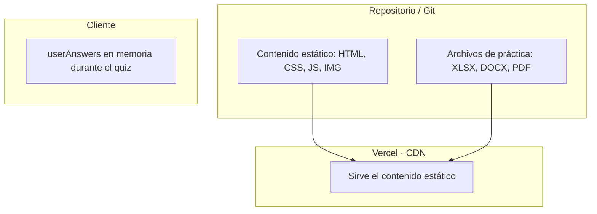

# Persistencia — Excel Learning Hub

Estrategia de almacenamiento del proyecto. **Todo el sitio es contenido estático** (HTML/CSS/JS/imágenes/archivos). No hay base de datos ni servicios externos para la funcionalidad principal.

## 1. Estrategia de persistencia



- **Contenido estático:** persistido en Git y servido por Vercel. No hay base de datos para teoría, fórmulas, tips, atajos ni prácticas.
- **Evaluaciones:** las preguntas están embebidas directamente en el HTML de cada test como arrays de JavaScript. Las respuestas del estudiante solo viven en memoria durante el test (`userAnswers[]`) y se descartan al salir.

## 2. Estructura de datos de evaluaciones

Cada test contiene un array `preguntasArray` con 10 objetos:

```javascript
{
  pregunta: "Texto de la pregunta",
  opciones: ["A", "B", "C", "D"],  // vacío para V/F
  respuesta: 0,                     // índice de la correcta
  tipo: "multiple"                  // o "vf"
}
```

### Tests activos

| Test | Archivo | Tema |
|------|---------|------|
| Fórmulas Básicas | `evaluaciones/test-formulas.html` | SUMA, PROMEDIO, CONTAR, fechas, texto |
| Fundamentos | `evaluaciones/test-teoria.html` | Qué es Excel, entorno, anatomía de funciones |
| Tipos de Datos y Referencias | `evaluaciones/test-referencias.html` | Tipos de datos, referencias, jerarquía |

## 3. Datos legacy (ya no se usan)

Los siguientes archivos existen en el repositorio pero **no son utilizados** por el sitio actual:

- `assets/db/eschema.sql` — Esquema de tablas `tests`, `preguntas`, `resultados`
- `assets/db/insert_preguntas_teoria.sql` — Semillas de preguntas para Supabase

Fueron parte de la implementación original con Supabase (ADR-003), reemplazada por evaluaciones estáticas (ADR-012).

## 4. Reglas de integridad

- **Barajado:** las preguntas se barajan aleatoriamente con `shuffleArray()` al iniciar cada test.
- **Respuestas dispersas:** la respuesta correcta no siempre está en la opción A.
- **Puntaje:** cada acierto suma 10 puntos (escala 0–100).
- **Sin persistencia:** no se guardan resultados de evaluaciones. Cada sesión es independiente.

## Referencias cruzadas

- Motor de evaluaciones: `assets/js/quiz-core.js`
- Tests: `evaluaciones/test-formulas.html`, `test-teoria.html`, `test-referencias.html`
- Arquitectura general: [ARQUITECTURA_GLOBAL.md](ARQUITECTURA_GLOBAL.md)
