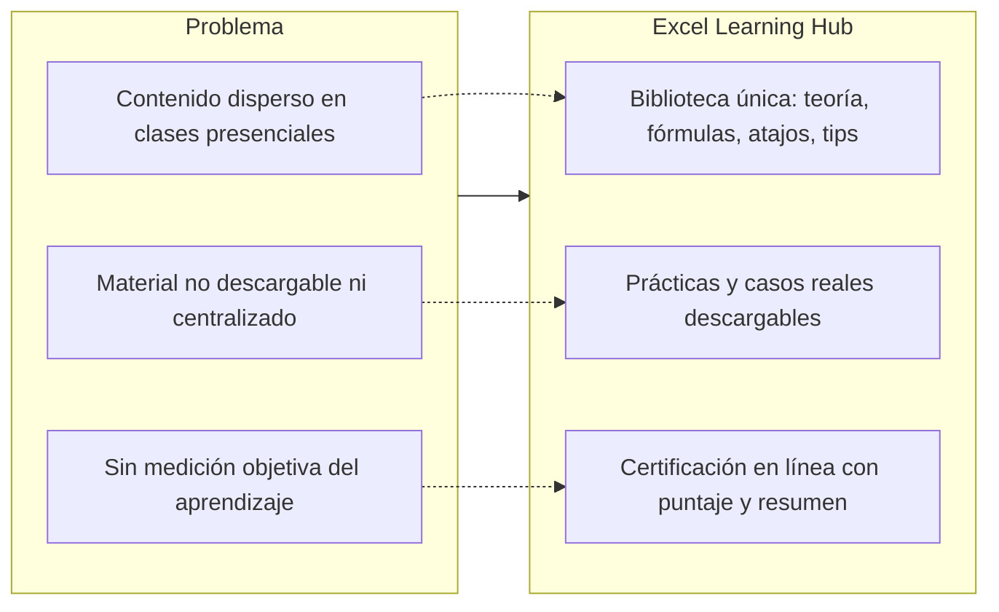
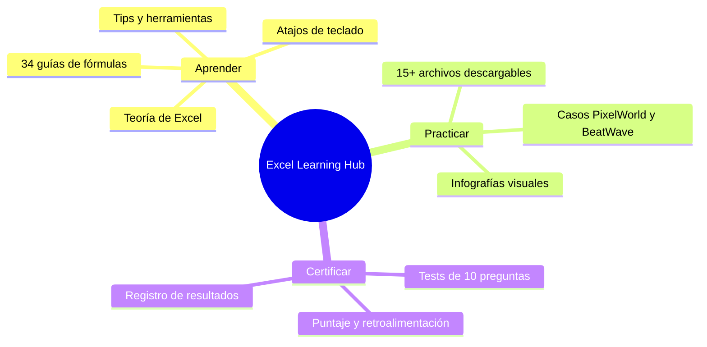

# Propuesta Comercial — Excel Learning Hub

## 1. Resumen ejecutivo

**Excel Learning Hub** es un portal educativo en español que centraliza teoría, fórmulas, atajos, tips, herramientas, prácticas y certificaciones de Microsoft Excel para el Instituto Nueva Tecnología (Prof. Samuel Durán). El sitio ofrece una ruta de aprendizaje estructurada —ver, practicar, evaluarse y certificarse—. Todo se publica como sitio estático en Vercel, sin costos de infraestructura, con un backend de datos (Supabase) solo donde hace falta: las evaluaciones.

## 2. Problema vs Solución

## 3. Mapeo de valor y capacidades

## 4. Traducción técnico-comercial

| Característica Técnica | Beneficio Directo | Impacto Financiero |
|------------------------|-------------------|--------------------|
| Sitio estático en Vercel | Cero costo de hosting y alta velocidad de carga | Ahorro total en infraestructura |
| Bibliotecas de fórmulas con buscador en vivo | Consulta inmediata: el estudiante encuentra la solución en segundos | Menos tiempo docente resolviendo dudas repetitivas |
| Archivos de práctica con casos empresariales | Aprendizaje por simulación de negocio real | Estudiantes aplican lo aprendido sin perder tiempo buscando material |
| Evaluaciones con persistencia en Supabase | Certificación verificable y trazable | Sustituye exámenes manuales de papel (calificación automática) |
| Interfaz responsive (móvil) | Estudio en cualquier dispositivo | Mayor alcance de estudiantes |

## 5. Casos de uso con ROI

> Las métricas de ahorro son **estimaciones** razonables basadas en la estructura del curso; no se han medido con datos de producción.

### Caso A — Certificación del curso (Institución)
- **Situación actual:** corregir exámenes de 30 estudiantes consume ~6 h/docente por evaluación.
- **Con la plataforma:** la corrección es automática (el motor calcula puntaje y guarda el resultado en Supabase).
- **ROI estimado:** ~6 h ahorradas por evaluación × 4 evaluaciones por ciclo = **~24 h por ciclo**, reasignables a docencia. *(Estimación)*

### Caso B — Preparación laboral del estudiante
- **Situación:** los estudiantes dedican horas a buscar tutoriales dispersos.
- **Con la plataforma:** 8 temas de teoría + 34 fórmulas + 6 tips centralizados reducen el tiempo de preparación.
- **ROI estimado:** de 20 h a ~10 h de estudio dirigido por tema. *(Estimación)*

## 6. Propuesta de expansión

1. **Certificación en Fórmulas** (bloqueada actualmente en `evaluaciones.html` como "Próximamente").
2. **Dashboard docente** sobre la tabla `resultados` para ver promedios por curso.
3. **Más casos empresariales** (nuevas empresas ficticias y sectores).
4. **Suscripción o venta de certificados** con validación en línea.

## Referencias

Detalles técnicos en [ARQUITECTURA_GLOBAL.md](ARQUITECTURA_GLOBAL.md), alcance y módulos en [CONTEXTO_PROYECTO.md](CONTEXTO_PROYECTO.md) y almacenamiento en [PERSISTENCIA.md](PERSISTENCIA.md).
