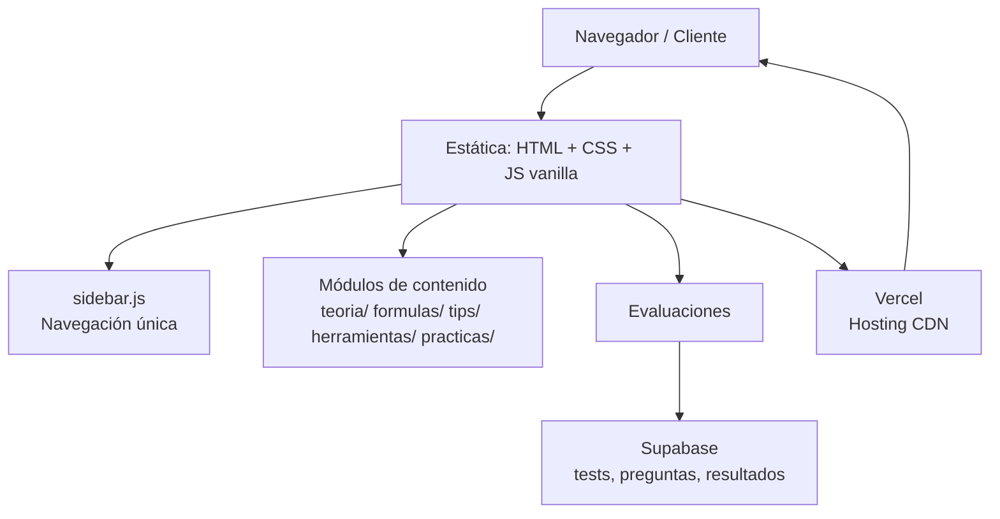

# Excel Learning Hub

**Portal educativo de consulta y recursos de Excel.** Sitio estático en español que reúne teoría, fórmulas, atajos, tips, herramientas, archivos de práctica y evaluaciones en línea, con certificación de conocimientos y un puente hacia la inteligencia artificial desde Excel vía VBA.

Proyecto creado por **Prof. Samuel Durán** (Instituto Nueva Tecnología) para el curso de Excel.

## Diagrama de arquitectura (resumen)



## Características principales

### Módulo de teoría
- Conceptos fundamentales (qué es Excel, entorno de trabajo, tipos de datos).
- Anatomía de funciones, referencias relativas/absolutas/mixtas, jerarquía de operaciones y diccionario de errores.
- Contenido en `teoria/` (8 páginas).

### Biblioteca de fórmulas
- 34 guías individuales de funciones (SUMA, BUSCARV, BUSCARX, FILTRAR, LET, DIVIDIRTEXTO, etc.) organizadas por nivel (básico, intermedio, avanzado) y categoría (Matemáticas, Estadística, Fecha y Hora, Lógica, Texto, Búsqueda).
- Buscador en vivo por función, descripción o categoría (`formulas.html`).

### Atajos de teclado
- Catálogo de atajos con estética *keycap* 3D y buscador en vivo (`atajos.html`).

### Tips y herramientas
- 6 trucos de productividad (Relleno Rápido, Transponer, fechas fijas, etc.) en `tips/`.
- Guías de herramientas integradas de Excel (Texto en Columnas, Validación de Datos) en `herramientas/`.

### Prácticas descargables
- 15+ archivos XLSX, DOCX y PDF para ejercitar (`practicas/archivos_practica/`).
- Casos empresariales de ejemplo: **PixelWorld** y **BeatWave**.

### Infografías interactivas
- Galería de 5 infografías con visor modal *fullscreen*, arrastre para desplazar y descarga (`index.html`).

### Evaluaciones en línea
- 3 tests de 10 preguntas con registro del estudiante, puntaje, retroalimentación y resumen de respuestas.
- Persistencia de resultados en **Supabase**.

### Inteligencia artificial integrada en Excel
- Función VBA `GEMINI_PROMPT2()` (`practicas/gemini_prompt.bas`) que envía el rango seleccionado de una hoja a la API de Gemini y devuelve el análisis en la celda.

## Atajos / comandos

| Atajo | Acción | Descripción |
|-------|--------|-------------|
| `Ctrl + G` | Guardar | Guarda/actualiza el libro actual en Excel |
| `F4` | Repetir / Fijar referencias | Repite la última acción o agrega los `$` de referencia absoluta |
| `Ctrl + Shift + L` | Autofiltro | Activa/desactiva filtros de tabla |
| `Ctrl + T` | Tabla | Convierte un rango en Tabla oficial |
| `Alt + Shift + 0` | AutoSuma | Autosuma automática de valores |
| `Ctrl + Shift + E` | Relleno Rápido | Completa patrones de datos detectados (Flash Fill) |
| `F11` | Gráfico | Crea un gráfico automático en hoja nueva |

*Estos atajos corresponden al contenido educativo del sitio; la web en sí no requiere comandos de instalación.*

## Requisitos previos

- **Navegador web** moderno (Chrome, Edge, Firefox, Safari) con JavaScript habilitado.
- **Conexión a internet** para las evaluaciones (Supabase) y para el CDN de la fuente Inter.
- **Excel 2016 o superior** (recomendado 2019/365) para usar los archivos de práctica y la macro `GEMINI_PROMPT2`.
- Para desarrollo local no se requiere ningún SDK ni gestor de paquetes: es HTML/CSS/JS puro.

## Instalación rápida

1. Clona el repositorio:
   ```bash
   git clone https://github.com/Samydex156/vanilla-blog-excel.git
   ```
2. Abre `index.html` en tu navegador o sirve la carpeta con cualquier servidor estático:
   ```bash
   npx serve .
   ```
3. Para desplegar en Vercel, importa el repositorio; la configuración `vercel.json` (`cleanUrls: true`) ya está incluida.

## Documentación

| Documento | Contenido |
|-----------|-----------|
| [ARQUITECTURA_GLOBAL.md](ARQUITECTURA_GLOBAL.md) | Capas, componentes, flujos críticos y ADRs |
| [CONTEXTO_PROYECTO.md](CONTEXTO_PROYECTO.md) | Visión de negocio, casos de uso, módulos, árbol de archivos y stack |
| [CRONOLOGIA_DESARROLLO.md](CRONOLOGIA_DESARROLLO.md) | Línea de tiempo de hitos y fases del proyecto |
| [GLOSARIO_TECNICO.md](GLOSARIO_TECNICO.md) | Términos técnicos ordenados alfabéticamente |
| [PROPUESTA_COMERCIAL.md](PROPUESTA_COMERCIAL.md) | Valor de negocio, problema vs solución y ROI |
| [PERSISTENCIA.md](PERSISTENCIA.md) | Estrategia de almacenamiento, entidades y reglas de integridad |

## Licencia y autoría

&copy; 2026 Instituto Nueva Tecnología — Prof. Samuel Durán. Material diseñado con fines educativos.
